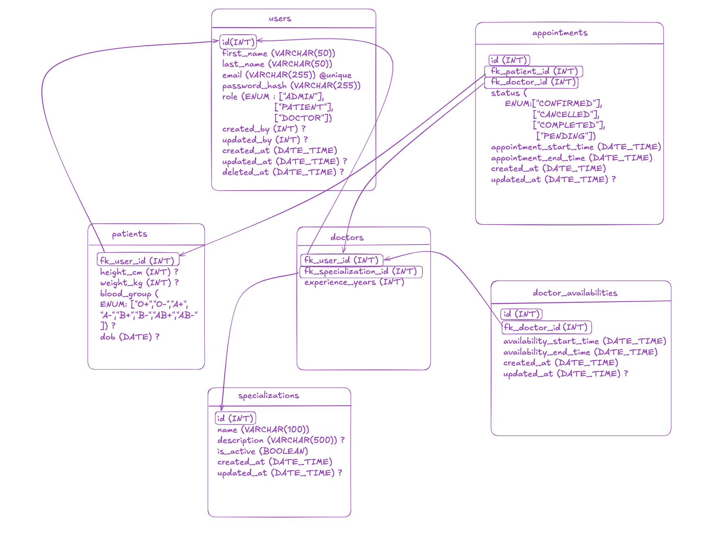

# Doctor Appointment Booking System

## Overview

The **Doctor Appointment Booking System** is a RESTful backend application built using **Node.js**, **Express**, **TypeScript**, **Prisma ORM**, and **PostgreSQL**. It provides APIs for managing doctors, patients, administrators, authentication, and appointment bookings while enforcing **JWT-based authentication** and **role-based authorization**.

The project follows a clean **Controller → Service → Repository** architecture, separating business logic, request handling, and database operations to make the codebase easier to maintain, test, and extend.

---

# Tech Stack

* Node.js
* Express.js
* TypeScript
* PostgreSQL
* Prisma ORM
* JWT Authentication
* Swagger (OpenAPI)
* Zod Validation

---

# Features

### Authentication

* User login using JWT
* Password verification
* Protected APIs using Bearer Token

### Admin

* Create doctors
* Create patients

### Patient

* View available doctors
* Book appointments
* View booked appointments

### Doctor

* View appointments assigned to them (future implementation)

### Public

* View available doctors
* View doctor details

---

# Database Schema



---

# API Documentation

The project exposes REST APIs grouped by functionality.

## Authentication

| Method | Endpoint        | Description           |
| ------ | --------------- | --------------------- |
| POST   | /api/auth/login | Login and receive JWT |

---

## Admin APIs

| Method | Endpoint            | Description      |
| ------ | ------------------- | ---------------- |
| POST   | /api/admin/doctors  | Create a doctor  |
| POST   | /api/admin/patients | Create a patient |

Only authenticated administrators can access these endpoints.

---

## Doctor APIs

| Method | Endpoint         | Description        |
| ------ | ---------------- | ------------------ |
| GET    | /api/doctors     | Get all doctors    |
| GET    | /api/doctors/:id | Get doctor details |

These endpoints are publicly accessible unless protected by your implementation.

---

## Appointment APIs

| Method | Endpoint          | Description                          |
| ------ | ----------------- | ------------------------------------ |
| POST   | /api/appointments | Book an appointment                  |
| GET    | /api/appointments | Get logged-in patient's appointments |

The appointment APIs require authentication.

Patients can only view their own appointments.

---

# Authentication

The application uses **JSON Web Tokens (JWT)** for authentication.

### Login Flow

1. User sends email and password.
2. Credentials are validated.
3. A JWT is generated.
4. The token is returned to the client.
5. The client sends the token in every protected request.

Example header:

```http
Authorization: Bearer <JWT_TOKEN>
```

The token contains:

```json
{
  "id": "user-id",
  "role": "patient"
}
```

The authentication middleware:

* Extracts the Bearer token.
* Verifies the JWT.
* Decodes the payload.
* Attaches the authenticated user's information to `req.user`.

---

# Authorization

After authentication, access is controlled using **role-based authorization**.

Supported roles:

* Admin
* Doctor
* Patient

Each protected route specifies which roles are allowed to access it.

Example:

```text
Admin
 ├── Create Doctor
 └── Create Patient

Patient
 ├── Book Appointment
 └── View Own Appointments

Doctor
 └── Doctor-specific endpoints
```

This ensures users can only access resources they are permitted to use.

---

# Project Architecture

The project follows the **Controller → Service → Repository** architecture.

```text
                Client
                   │
                   ▼
              Express Route
                   │
                   ▼
             Controller Layer
                   │
                   ▼
              Service Layer
                   │
                   ▼
            Repository Layer
                   │
                   ▼
             Prisma ORM
                   │
                   ▼
             PostgreSQL
```

### Controller

* Handles HTTP requests.
* Reads request parameters.
* Returns HTTP responses.
* Does not contain business logic.

---

### Service

* Contains business logic.
* Performs validations.
* Coordinates repositories.
* Throws application errors.

---

### Repository

* Contains all database queries.
* Uses Prisma Client.
* No business logic.

---

# Folder Structure

```text
src
│
├── config
│   ├── prisma.ts
│   └── swagger.ts
│
├── controllers
│
├── middleware
│
├── repositories
│
├── routes
│
├── services
│
├── docs
│   └── swagger.yaml
│
├── validations
│
├── utils
│
├── types
│
├── app.ts
└── index.ts
```

### Folder Responsibilities

**controllers/**

Receives HTTP requests and returns responses.

**services/**

Implements business logic.

**repositories/**

Contains all Prisma database operations.

**middleware/**

Authentication, authorization, validation, and request processing.

**routes/**

Maps API endpoints to controller methods.

**validations/**

Zod schemas used to validate incoming requests.

**config/**

Application configuration, Prisma client initialization, and Swagger setup.

**docs/**

Swagger/OpenAPI specification.

**types/**

Shared TypeScript interfaces and custom types.

**utils/**

Reusable helper functions.

---

# API Documentation

Swagger UI is available after starting the server.

```text
http://localhost:3000/api-docs
```

This provides interactive API documentation where protected endpoints can be tested by supplying a Bearer JWT.

---

# Running the Project

Install dependencies:

```bash
npm install
```

Run database migrations:

```bash
npx prisma migrate dev
```

Seed the database (if configured):

```bash
npx prisma db seed
```

Start the development server:

```bash
npm run dev
```

The server will be available at:

```text
http://localhost:3000
```

Swagger documentation:

```text
http://localhost:3000/api-docs
```

---

# Design Principles

* Layered architecture
* Separation of concerns
* Type-safe development with TypeScript
* Database abstraction using Prisma
* Input validation using Zod
* JWT-based authentication
* Role-based authorization
* Self-documenting APIs using Swagger

---

# Future Improvements

* Appointment cancellation and rescheduling
* Doctor availability and time-slot management
* Pagination and filtering
* Refresh token support
* Password reset functionality
* Email notifications
* Unit and integration testing
* Docker support
* CI/CD pipeline
* Rate limiting and request throttling
* Audit logging
